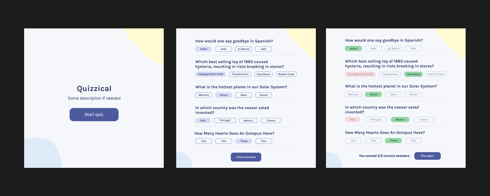

# 🎉 Quizzical — React + Vite Quiz App

A simple general knowledge quiz built with **React** and **Vite**.  
It fetches trivia questions from [Open Trivia DB](https://opentdb.com/), shuffles the answers, and checks your score.

---

## 🚀 Getting Started

1. **Install dependencies**
   ```bash
   npm install
   ```

2. **Run the dev server**
    ```bash
    npm run dev
    ```


